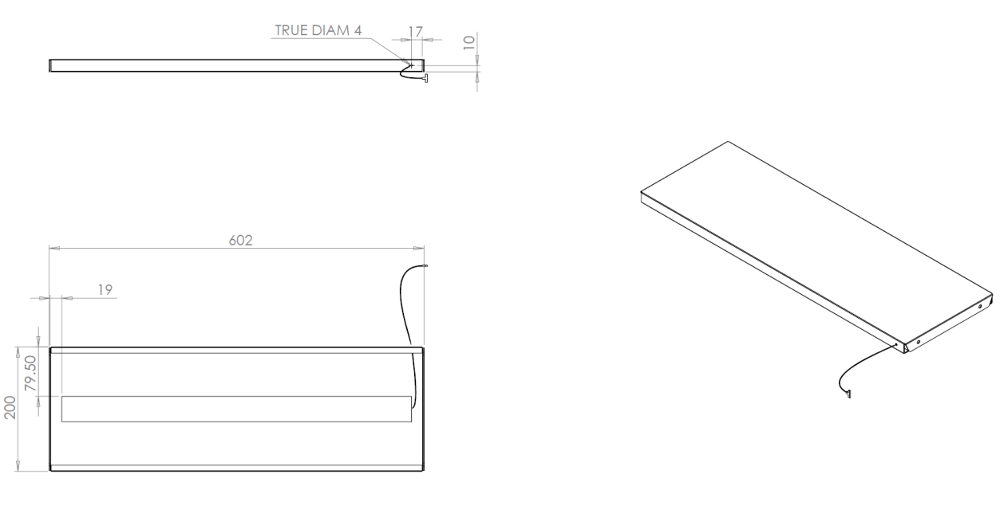
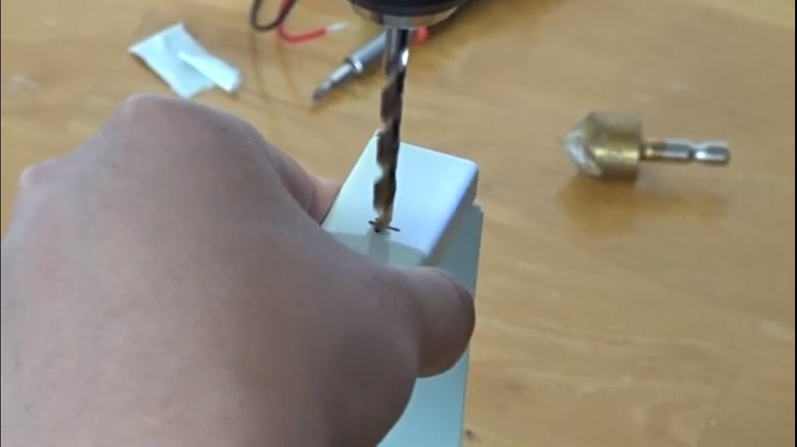
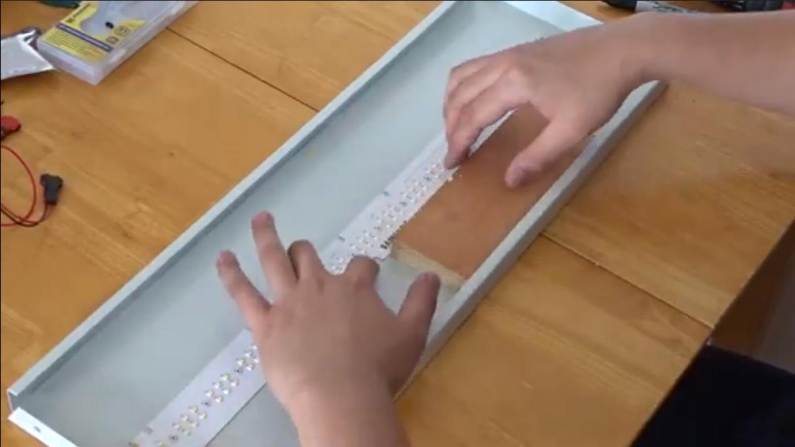
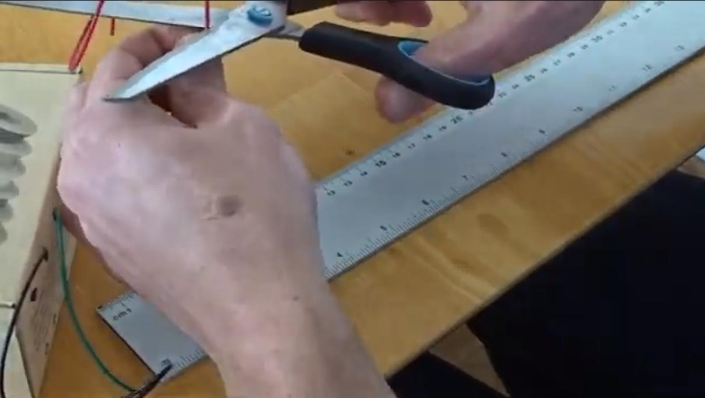
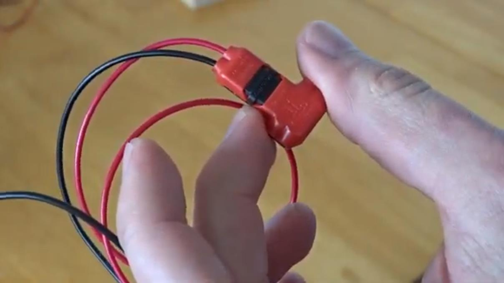
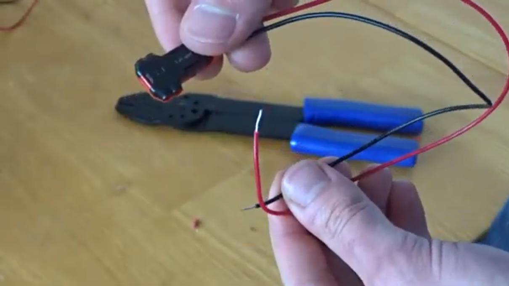
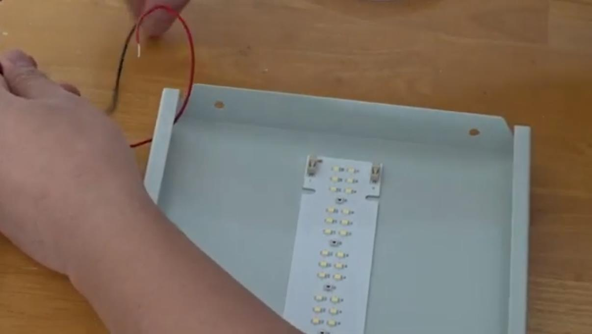
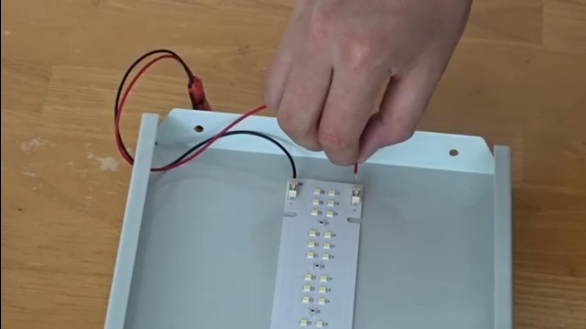

Light shelves
=================================================================================
× 6

Materials
----------------
- 6 × Twin Slot shelf 600x200mm
- 5 × 2ft horticultural LED module
- 1 box × 1AWG20-22 wire, black & red
- 1 ×Heat resistant, double-sided tape
- Cable T connectors

Tools / Settings
----------------
- Electric drill
- Metal drill bit, 4mm
- Wire stripper

Method
----------------

1. Drill holes in the shelf side so that the hole is on the back left when the shelf is installed. The water system will be on the right side of the shelf, the electric system on the left. Therefore all holes for cables need to be on the left side.
2. Use double-sided tape to glue the LED strip into place.

3. Cut cables to length. (30cm black, 26cm red)
4. Attach T connector to one side of the cable.

5. Strip wires 8mm on the other side of each cable
6. Feed wires through the hole drilled before

7. Push into the connector on LED PCB
8. Done
