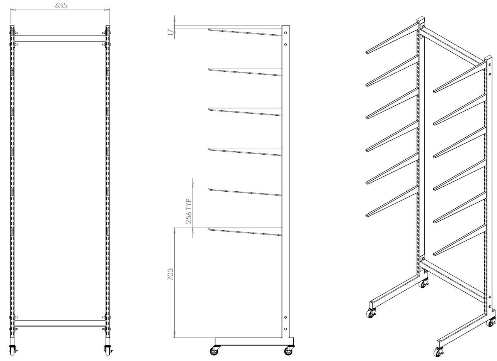
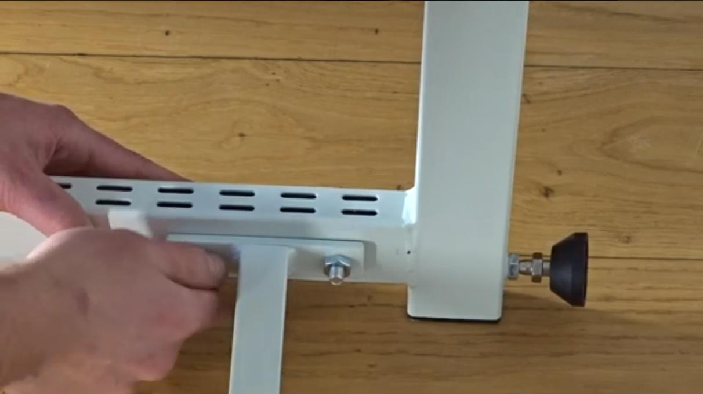
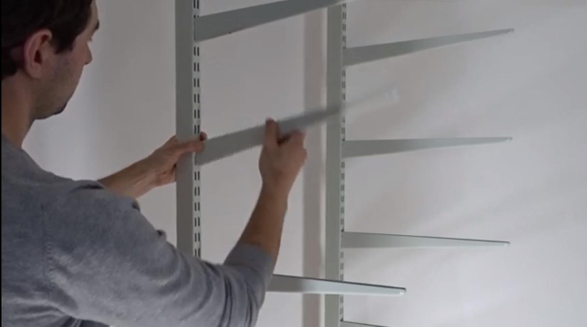
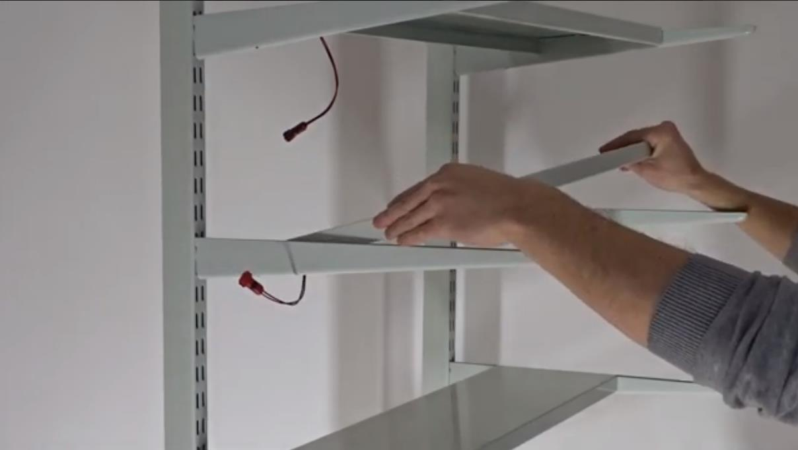

Shelving - Freestanding
=================================================================================
× 1

Materials
----------------
- 2x T Slot Upright Freestanding
- 2x Tie Bar 600mm
- 8x M12 Nuts and Bolts
- 4x adjustable feet with M8 thread
- 4x Castor Wheels with M8 thread (alternative to adjustable feet)
- 10x U Bracket
- 5x Light Shelf
- 1x Shelf without light
- 20x Grow Bar

Tools
----------------
- 12mm spanner
- 14mm spanner

Method
----------------
1. Make sure you have sufficient space to set up your shelving. Setting up the Shelf is more manageable with 2 people but can be done alone if necessary.

.. image:: _static/image_27.png

2. Connect adjustable feet or castor wheels to the bottom of the twin slot profiles.
3. Connect the Twin Slot Profiles with Tie Bars and the required Nuts & Bolts. If you are alone, we recommend conducting step 2 on the ground.
4. Tip the unit over and connect feet or castor wheels to the threaded holes in the bottom
5. Set the unit up again.

6. Now, simply slot in the U Brackets, leaving 6 holes in between each bracket.

7. Put the light shelves on top of the U Brackets so they can slide to the front and back. The cables of the light shelf should come out towards the back left of the unit.
8. Done
