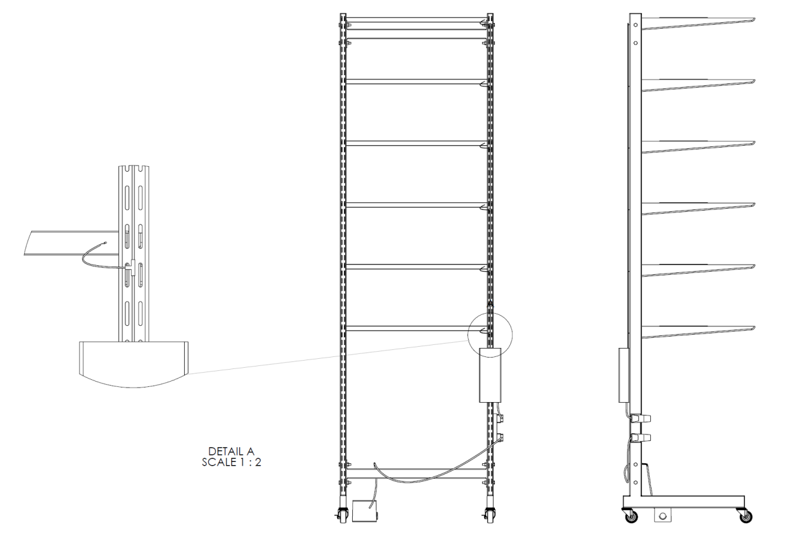
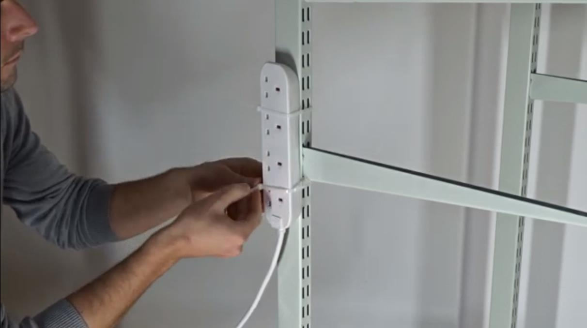
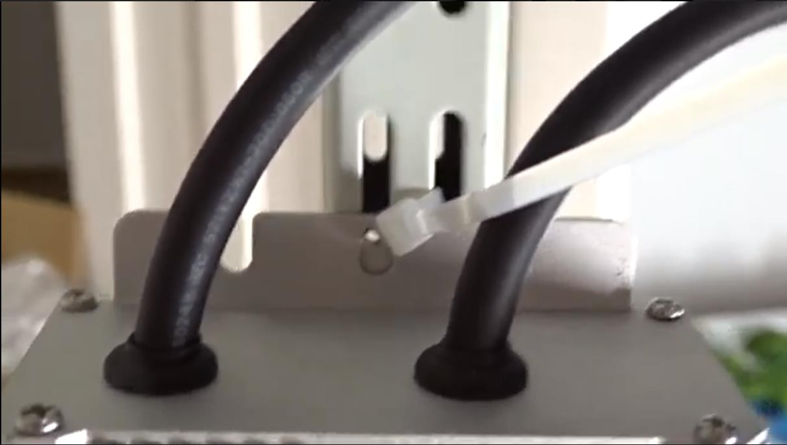
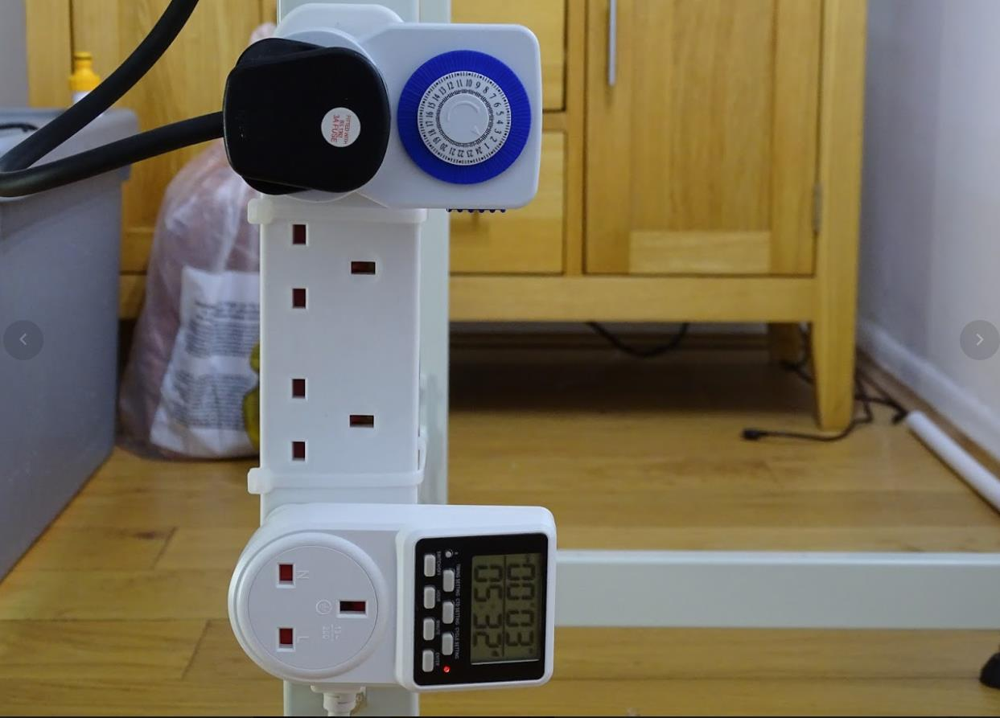
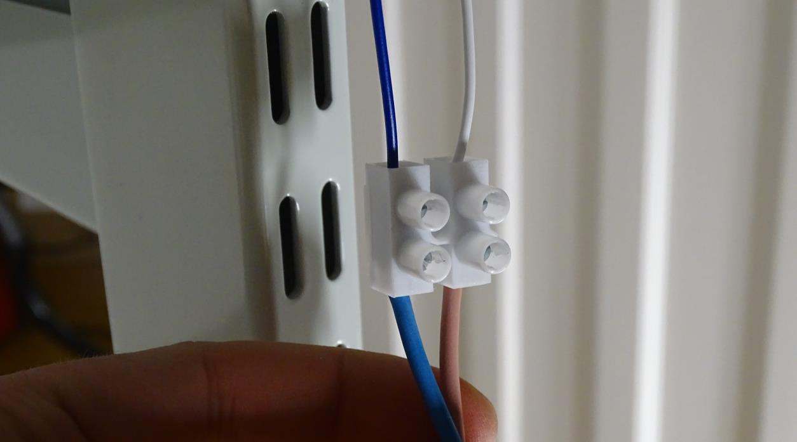
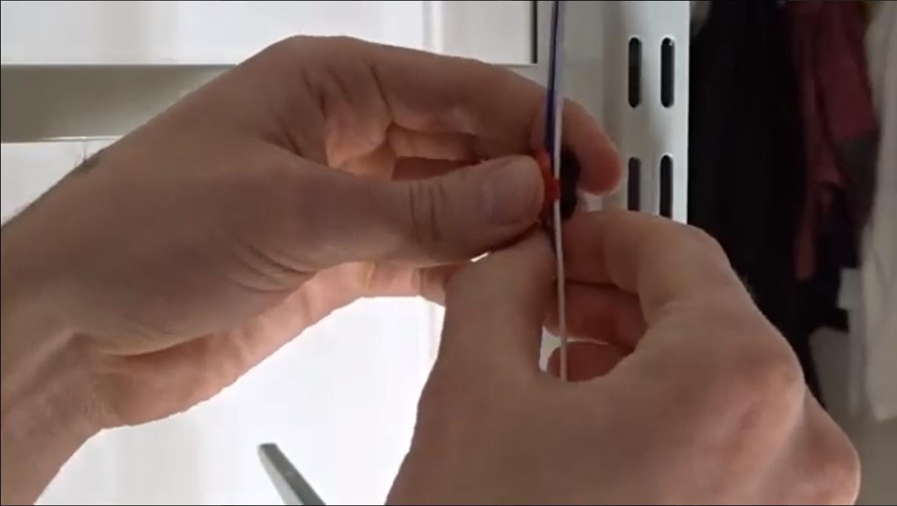

Wiring
=================================================================================

Materials
----------------
- Cable Ties
- Multi-Plug
- Meanwell HLG300 Power Supply
- Mechanical Plug Timer
- Digital Plug Timer
- 2x AWG20 Cable 110cm
- Isolation Tape

Tools
----------------
- Wire Stripper
- Scissors
- Pliers

Method
----------------

1. Use Cable Ties to attach the extension cord with a multi-plug to Twin Slot Upright’s right (looking from the front). The attachment process can either be done with plugs facing outside or inside if you would like to hide the components. We usually prefer mounting it facing out so that the plugs are easier to access.

2. Attach the Meanwell Power supply to the back of the upright using cable ties. Make sure the extension cord is NOT connected to a plug socket.

3. Plug the mechanical and the digital plug timer into the socket. Lighting will use the mechanical one, and the pump will use the digital one since this requires more accurate timing that a mechanical plug timer cannot offer.

4. Cut two AWG20 cables to about 110cm length (use red for positive and black for negative)
5. Connect the left output cable of the Meanwell power supply via screw connectors to the AWG cables and mount the cables to the inside of the Twin Slot upright, all the way to the top of the unit.
6. Connect a potentiometer to the suitable output cable of the Meanwell power supply. Your hectar farm can use this to dim the lighting. (coming soon)

7. Now, connect the T connectors coming from the light shelves to the cable you just installed. Pay attention to the drawing on the back of the t-Connector. It will tell you where to connect positive and negative. The T Connector requires some force to snap into the cable, so use pliers or your wire stripper for this.
8. After connecting all t-connectors, you can plug the unit into your main plug. The lighting should appear after about 1 second if you have followed the guide correctly. If you have any trouble with this, seek help from someone with more experience.
9. Done
